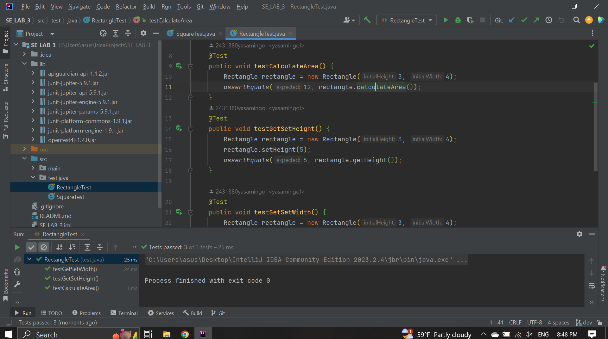
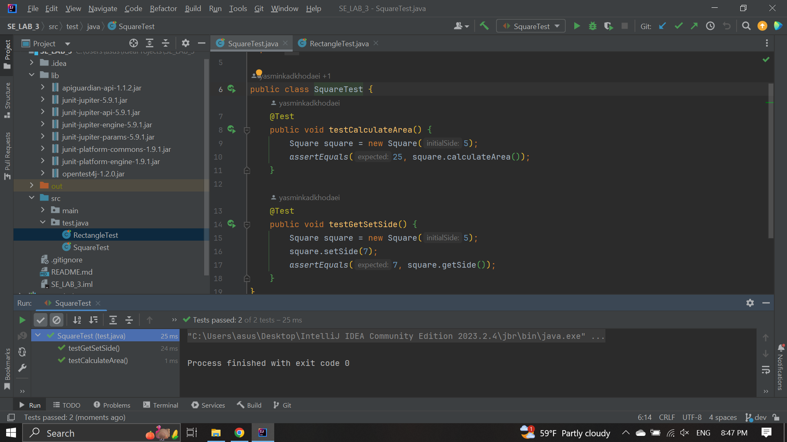

# SE_LAB_3
<h3>گزارش و توضیحات مربوط به آزمایش</h3>

ابتدا در محیط IDE خود یک پروژه با maven می‌سازیم. در اینجا ما از IDE intellij استفاده کرده ایم. با توجه به توضیحات دستور العمل آزمایش از روش TDD برای ساخت پروژه‌مان استفاده کردیم. ابتدا دو برنج feature/RectangleClass و feature/SquareClass ساختیم و هر کدام از اعضای تیم به صورت جداگانه و همزمان روی برنچ انتخابی خود شروع به کار کردند. با توجه به توضیحات روش TDD از نوشتن تست‌کیس‌ها با کتابخانه junit  شروع کردیم و پس از تعریف تست‌ها هر کدام را پر کردیم.
پس از پر کردن تست‌کیس‌ها به سراغ پر کردن کلاس مربع و مستطیل رفتیم و همزمان به این مسائل توجه داشتیم که اصول SOLID رعایت شوند ( به طور ویژه اصل OCP) و مستطیل و مربع را تعریف کردیم و خواسته‌های دستورالعمل آزمایش را به صورت توابع پیاده‌سازی کردیم.
در قدم آخر هم تست‌ها را با هم ران کردیم تا مطمئن شویم که همه چیز درست کار می‌کند و مشکلی وجود ندارد که همانگونه که در عکس‌ها مشاهده می‌کنید، همه تست‌ها با موفقیت ران شدند و مشکلی وجود نداشت.
  

تست‌های پاس شده

تست‌های پاس شده

<h3>سوال ۱</h3>

نه، اینها رویکردهای متناقضی نیستند. در عوض، آنها  رویکرد های مختلفی را در مورد نقش آزمایش در فرآیند توسعه نرم افزار نشان می دهند.
تست سنتی شامل نوشتن تست‌هایی پس از نوشتن کد است تا تایید شود که کد الزامات را برآورده می‌کند یا نه. در مقابل، TDD (Test-Driven Development) ابتدا از نوشتن تست‌ها حمایت می‌کند تا رفتار مطلوب کد را قبل از نوشتن تعریف کند. این رویکرد کد cleanتری را ترویج می‌دهد که نیازمندی‌ها را برآورده می‌کند و maintenance آن آسان‌تر است وگرنه در تناقض با هم نیستند.

<h3>سوال ۲</h3>

در فرایند ایجاد نرم افزار مراحل و درجات مختلفی از آزمون نرم افزار وجود دارد که آن ها را به ترتیبی ریزدانگی تا درشت‌دانگی نام خواهیم برد:
Unite Testing - Integration Testing - System Testing - Acceptance Testing - Regression Testing - Smoke Testing - Performance Testing - Security Testing - Usability Testing

<h3>سوال ۳</h3>

خیر. همه تست‌ها توسط مهندسین نرم‌افزار طراحی و اجرا نمی‌شود. افراد دیگری هم در به وجود آوردن تست‌ها نقش دارند برای مثال  manual testers و کارشناسان QA , test automation engineers, performance testers و usability testers ه, همه این آدم‌ها در کنار هم تست‌ها را به وجود می ‌اورند و هر کدام از یک جنبه نرم‌افزار نهایی را بررسی می‌کنند.

<h3>سوال ۴</h3>

اصول SOLID به صورت کلی در مرحله ی طراحی و پیاده سازی نرم‌افزار مورد استفاده قرار میگیرند چرا که همه ی اصول نام برده شده در آن در واقع به cohesion و کاهش coupling در کد طراحی و پیاده سازی شده برمیگردند.  اگر چه باید در نظر گرفت که با داشتن یک راهبرد تست‌رانه ایجاد نرم‌افزار، آزمون و نوشتن تست ها در عمل به دو مرحله ی دیگر کمک می کند و چون مبنای طراحی و پیاده‌سازی کد اصلی از این تست ها پیروی می‌کنند، باید این اصول را در تحلیل و نوشتار تست ها و مرحله ی آزمون نیز در نظر داشته باشیم.

<h3>سوال ۵</h3>

همانطور که در لینک داستان ارث‌بری مربع و مستطیل نوشته شده است، یکی از راه حل های مناسب برای حالتی که مربع از مستطیل ارث بری کند و مشکلی ایجاد نشود این است که این پیش فرض را داشته باشیم که وقتی شکلی ساخته می‌شود دیگر امکان تغییر آن را نداشته باشیم. به عبارت دیگر اگر قرار است شکلی را تغییر دهیم گویی میخواهیم یک شکل جدید را ایجاد کنیم و امکان تغییر ابعاد شکل ایجاد شده وجود نداشته باشد. با این پیش فرض اگر پیش برویم دیگر مشکلی که در مثال این لینک گفته شده بود (افزایش چند باره ی ابعاد مربع به جای افزایش یکباره) وجود نخواهد داشت و میتوان با منطق درستی مربع را از مستطیل به ارث برد.

